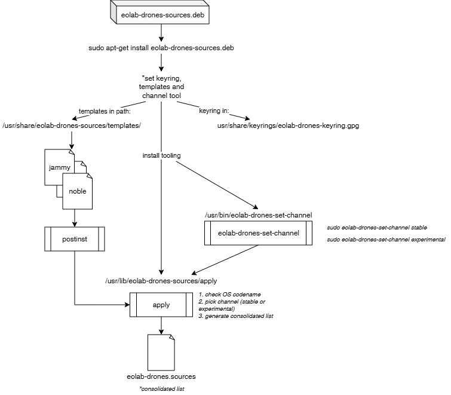

# `eolab-drones-sources`

Helper Debian package to manage eolab-drones’ APT source lists.

## Usage - From Users and Developers View

```
wget -O /tmp/eolab-drones-sources.deb \
  https://github.com/EOLab-HSRW/drones-sources/releases/latest/download/eolab-drones-sources_latest.deb
sudo apt-get install /tmp/eolab-drones-sources.deb
```

If you already have the `eolab-drones-sources` package, you can update the source list by simply:

```
sudo apt-get install --only-upgrade eolab-drones-sources
```

**For maintainers and developers**: We offer a `stable` (default) set of stable sources, but we also have an `experimental` set of sources with less-tested packages or more bleeding edge sources. You can easily change the set of source by running:

```
sudo eolab-drones-set-sources experimental
sudo apt-get update
```

## How to publish new versions - Maintainer(s)

1. Update [debian/changelog](debian/changelog). For details how, see [4.3. changelog - Debian Manual](https://www.debian.org/doc/manuals/maint-guide/dreq.en.html#changelog)
2. Commit and push
3. Tag and push the tag. This triggers the CI and releases a new version.

## Overview - Maintainer(s)

Installing `eolab-drones-sources.deb` (e.g. via `sudo apt-get install ./eolab-drones-sources.deb`) deploys three things:
- APT keyring: Installs a keyring containing the public key used to verify (sign) our packages.
- Source templates: Stores a collection of APT source "templates" named `<codename>-<channel>.sources`.
- postinst: Runs `/usr/lib/eolab-drones-sources/apply` to generate the consolidated set of APT sources.
- Channel/tooling: `/usr/bin/eolab-drones-set-channel` provides an easy way to switch channels; internally it calls the apply helper at `/usr/lib/eolab-drones-sources/apply`.


